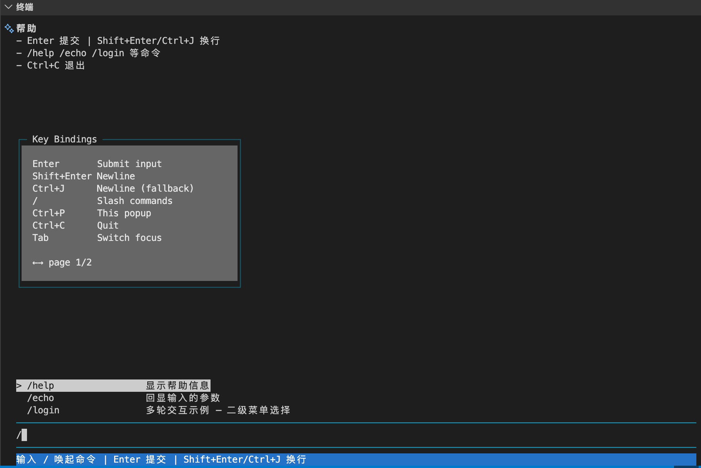

# min-tui

[](https://pkg.go.dev/github.com/tim5wang/min-tui)

A lightweight terminal UI library in pure Go, purpose-built for **coding agents**.  
Streaming output, multi-line input, markdown with syntax highlighting, slash commands, popups — ~2,400 lines, zero heavy deps.

<p align="center">
  
</p>

```bash
go get github.com/tim5wang/min-tui
```

## Features

- **Streaming output** — `Write()` renders incrementally; overflow enters terminal scrollback via a temporary scroll region
- **Multi-line input** — `Shift+Enter` / `Ctrl+J` newlines; input box expands to `MaxInputRows` (default 8)
- **Slash commands** — `/name` filtered dropdown; arrow keys navigate, Enter selects, Esc cancels
- **Multi-turn interaction** — `Prompt()` for text, `Select()` for menus, written like sync code
- **Popup windows** — overlay dialogs with focus switching (Tab), interactive `OnKey`, custom colors
- **Markdown** — headings, **bold**, *italic*, `inline code`, fenced code blocks (with syntax highlighting), aligned tables, blockquotes
- **Status bar** — 5 styles (default / info / warning / error / success)
- **Configurable** — border color, custom markdown renderer, event channel, heading marks, spacious mode, app-owned input history
- **Concurrency-safe** — `Write()` from any goroutine while `ReadLine()` blocks

## Quick Start

```go
package main

import "github.com/tim5wang/min-tui"

func main() {
    tui, _ := minitui.New()
    defer tui.Close()

    tui.SetStatus("Enter to submit | / for commands", minitui.StatusInfo)

    for {
        input, err := tui.ReadLine()
        if err != nil { return }
        tui.WriteString("You said: " + input + "\n")
    }
}
```

## Config

```go
tui, _ := minitui.NewWithConfig(minitui.Config{
    EventCh:          myEventCh,         // optional event sink
    BorderColor:      "\x1b[36m",       // input box borders (default: dim)
    RenderLine:       myRenderer,        // custom markdown→ANSI
    MaxInputRows:     12,                // default 8
    ShowHeadingMarks: true,              // keep `## Title` visible (default: false)
    Spacious:         true,              // blank lines between blocks (default: false)
    HistoryFn:        myHistory,         // ↑/↓ on empty input (see below)
})

tui.WriteString("output\n")              // streaming output
input, err := tui.ReadLine()             // blocking (Ctrl+C → err)
tui.SetStatus("...", minitui.StatusWarning)
defer tui.Close()                        // restore terminal
```

### Config fields

| Field | Default | Description |
|-------|---------|-------------|
| `EventCh` | `nil` | Optional `chan<- Event` for `EventSubmit` / `EventResize` / `EventInterrupt` |
| `BorderColor` | `\x1b[2m` (dim) | ANSI escape for input box border |
| `RenderLine` | built-in | Custom markdown → ANSI line renderer. Receives raw line, returns styled |
| `MaxInputRows` | `8` | Maximum visible rows in the input box |
| `ShowHeadingMarks` | `false` | Keep `#` / `##` marks visible on headings |
| `Spacious` | `false` | Insert blank lines before/after headings, code blocks, tables |
| `HistoryFn` | `nil` | Called on `↑`/`↓` when input is empty — see [Input History](#input-history) |

## Input History

`Config.HistoryFn` lets the application implement command history without
min-tui owning any state. The callback fires only when the user presses
`↑` or `↓` while the input box is a single empty line — multi-line input
keeps the normal cursor-move behavior.

```go
history := []string{"help", "echo", "/login"}
idx := len(history) // past the end

tui, _ := minitui.NewWithConfig(minitui.Config{
    HistoryFn: func(direction int) string {
        // direction: -1 = ↑ (older), +1 = ↓ (newer)
        if len(history) == 0 { return "" }
        if idx == len(history) && direction > 0 { return "" }
        if idx == len(history) { idx = len(history) - 1 } else { idx += direction }
        if idx < 0 { idx = 0 }
        if idx > len(history) { idx = len(history); return "" }
        return history[idx]
    },
})

// In your ReadLine loop, append on submit:
input, _ := tui.ReadLine()
if input != "" { history = append(history, input); idx = len(history) }
```

**Contract:**

- The callback runs on the TUI input goroutine. It must not call back into
  the TUI (no `Write`, `SetStatus`, `ReadLine` from inside the callback).
- Return `""` to leave the input unchanged (e.g. at the boundary of the
  history list). The key is consumed in this case so the cursor does not
  also try to move on a single-line input.
- The application owns the storage, the cursor, the de-duplication, the
  persistence across sessions — min-tui only fires the callback and
  places the returned text into the input box.

## Slash Commands

```go
tui.RegisterCommand(minitui.SlashCommand{
    Name: "login",
    Handler: func(ctx *minitui.CommandContext) {
        // secondary menu
        method := ctx.Select("选择方式", []minitui.SelectOption{
            {Label: "password", Description: "用户名+密码"},
            {Label: "token",    Description: "Token 认证"},
        })
        if method < 0 { return }           // Esc cancelled

        // text input
        username := ctx.Prompt("用户名")
        password := ctx.Prompt("密码")

        ctx.Write("登录成功: " + username + "\n")
        ctx.SetStatus("就绪", minitui.StatusSuccess)
    },
})
```

### SlashCommand Fields

| Field | Description |
|-------|-------------|
| `Name` | Command identifier (e.g. `"help"`, `"login"`) |
| `Description` | Shown in the dropdown when filtering |
| `Handler` | `func(ctx *CommandContext)` called when the user selects the command |

### CommandContext Methods

| Method | Description |
|--------|-------------|
| `Prompt(prompt) string` | Block until user presses Enter, return text. If `prompt` is non-empty, it is shown in the status bar |
| `Select(prompt, opts) int` | Show dropdown, return index (-1 = Esc). If `prompt` is non-empty, it is shown in the status bar |
| `Write(s)` | Append output to the history area |
| `SetStatus(text, style)` | Update status bar |

## Popup Windows

```go
// Open a popup by registering a global key handler.
tui.SetGlobalKeyHandler(func(k minitui.KeyEvent) bool {
    if k.Ctrl && k.Rune == 'p' {
        tui.PushPopup(minitui.Popup{
            Title:  "Help",
            Width:  40, Height: 12,
            Render: func(w, h int) []string {
                return []string{"", "  Esc to close", "", "  Tab to toggle focus"}
            },
            OnKey: func(k minitui.KeyEvent) minitui.PopupAction {
                if k.Special == minitui.KeyDown { return minitui.PopupUpdate }
                return minitui.PopupPassthrough
            },
        })
        return true
    }
    return false
})
```

### Popup Fields

| Field | Description |
|-------|-------------|
| `Title` | Window title (auto-truncated if too wide) |
| `Width`, `Height` | Size in cells (0 = auto: 80% width, 60% height) |
| `BorderColor` | ANSI color when focused, default cyan |
| `BgColor` | Background when focused, default white |
| `BorderColorUnfocus` | Border when unfocused, default dim cyan |
| `BgColorUnfocus` | Background when unfocused, default gray |
| `Render(w,h)` | Return content lines (must be ≤ h-2 lines) |
| `OnKey` | Handle keys → `PopupPassthrough` / `PopupUpdate` / `PopupClose` |
| `OnClose` | Called after popup removed |

### Popup Actions

| Action | Effect |
|--------|--------|
| `PopupPassthrough` | Key not handled — input editor receives it |
| `PopupUpdate` | Key handled — re-render popup and input box |
| `PopupClose` | Key handled — dismiss the popup |

### Focus & Interaction

| Key | Action |
|-----|--------|
| `Tab` | Toggle focus between input ↔ popup |
| `Esc` | Close popup |
| Focused popup | Bright border, keys go to `OnKey` |
| Unfocused popup | Dim border, keys pass through to input editor |

## Key Bindings

| Key | Action |
|-----|--------|
| `Enter` | Submit / confirm |
| `Shift+Enter` / `Ctrl+J` | Insert newline |
| `Ctrl+C` | Interrupt (returns error from `ReadLine`) |
| `Esc` | Cancel slash / close popup |
| `Tab` | Insert spaces (normal) / toggle popup focus (popup open) |
| `↑` `↓` | Navigate dropdowns; on empty input, fires `Config.HistoryFn` (see [Input History](#input-history)) |
| `←` `→` | Move cursor |
| `Home` `End` | Jump start/end of line |
| `Ctrl+A` `E` `K` `U` `W` | Emacs shortcuts |
| `Backspace` / `Delete` | Delete char |

`KeyEvent.Special` exposes the constants `KeyUp` / `KeyDown` / `KeyLeft` / `KeyRight` / `KeyHome` / `KeyEnd` for popup handlers.

## Markdown

| Syntax | Rendering |
|--------|-----------|
| `# Heading` … `######` | **Bold** (marks hidden by default; set `ShowHeadingMarks: true` to keep them) |
| `**text**` | **Bold** |
| `*text*` | *Italic* |
| `` `code` `` | Dim inline code |
| ` ``` ` fenced block | Dim block; with language info, syntax-highlighted |
| `\| col \| col \|` | Aligned table with header separator |
| `> quote` | Gray background blockquote |

### Fenced Code Highlighting

Add the language to the fence info string:

````
```go
func add(a, b int) int { return a + b }
```
````

Supported languages (zero-dep tokenizer): **go**, **python** (py), **javascript** (js), **typescript** (ts), **rust** (rs), **bash** (sh), **sql**.

Each language tokenizes: keywords (yellow), types (cyan), strings (green), comments (gray), numbers (purple).

## Events

```go
eventCh := make(chan minitui.Event, 8)
go func() {
    for ev := range eventCh {
        switch ev.Type {
        case minitui.EventSubmit:    // ev.Input holds the submitted text
        case minitui.EventResize:    // ev.Width, ev.Height
        case minitui.EventInterrupt: // Ctrl+C pressed
        }
    }
}()
```

`Event` is delivered on the goroutine that calls `ReadLine`. Reading is non-blocking — events are sent best-effort.

## Status Bar

```go
tui.SetStatus("Ready",     minitui.StatusDefault) // dim white
tui.SetStatus("Hint",      minitui.StatusInfo)    // cyan
tui.SetStatus("Working…",  minitui.StatusWarning) // yellow
tui.SetStatus("Failed",    minitui.StatusError)   // red
tui.SetStatus("Done",      minitui.StatusSuccess) // green
```

## Dependencies

Only [`golang.org/x/term`](https://pkg.go.dev/golang.org/x/term).

The built-in syntax highlighter is hand-written, ~200 lines — no chroma, no prism, no WASM.

## Terminal Support

**iTerm2**, **Terminal.app**, **WezTerm**, **Kitty**, **VS Code** terminal.

- `Shift+Enter` needs kitty/XTerm modifyOtherKeys. Use `Ctrl+J` as universal fallback.

## License

MIT